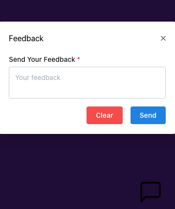
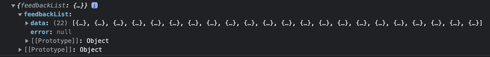

# 

# Trendyol Feedback App

<table>
<tr>
<td>
 You can send any feedback with this application. 
</td>
</tr>
</table>

## Demo

Here is a working live demo : [Live Demo](https://trendyol-feedback.web.app/)

## Notes For Reviewer

- I used free heroku server so when you send request, it can be asleep. Please wait a few seconds after first request. :)
- I saved the data in mongodb. You can check in console.

# 

## Usage

- nvm use 16
- yarn
- yarn start

## Tests

- yarn test

## Built with

- [React](https://reactjs.org/) - A JavaScript library for building user interfaces.

- [Testing Library](https://testing-library.com/docs/) - The @testing-library family of packages helps you test UI components in a user-centric way.

- [Msw](https://mswjs.io/) - Mock by intercepting requests on the network level. Seamlessly reuse the same mock definition for testing, development, and debugging.

- [Axios](https://axios-http.com/) - Axios is a simple promise based HTTP client for the browser and node.js. Axios provides a simple to use library in a small package with a very extensible interface.

- [Mantine](https://mantine.dev/) - A fully featured React components library.

- [Firebase - Hosting](https://firebase.google.com/) - With Firebase Hosting, you can deploy a single-page web app, a mobile app landing page, or a progressive web app without all the hassle.
